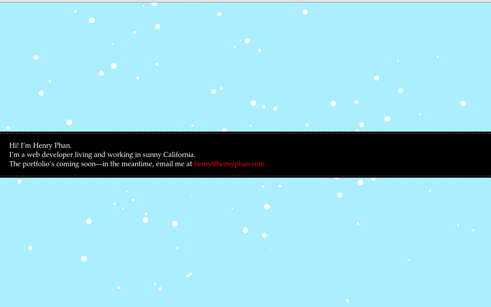

!SLIDE smbullets 15seconds 1
# Nat Welch 
### natwelch.com  /  @icco

!SLIDE 15seconds bullets 2
# Assumptions

 * You believe in financial risk taking.  <small>(You're not 40 after-all)</small>
 * You don't really want to work at a large company right out of college.
 * Aimed mainly at college students.  <small>(But general advice is here too...)</small>

!SLIDE 15seconds 3
# IANA*
<!--
I am not a hiring manager, a lawyer, a psychologist, a human resources person, a counselor, etc.
-->

!SLIDE 15seconds smaller 4
# Share Your Work
<!--
# You do all of this work in college
## you write papers
## do projects
## and generally make cool shit
# but all of it just sits there
# why don't you share it?
-->

!SLIDE 15seconds bullets 5
# Excuses for not sharing:

 * It's too hard
 * My work sucks
 * No one cares

!SLIDE 15seconds bullets 6
# (partially) Lies!

 * takes 30 minutes
 * you will actually come back to it
 * 90% of the time, no one cares

!SLIDE 15seconds smbullets 7
# But that 10% of the time can get you to:

 * start a company 
 * work with really cool people (excuse to drink beer) 
 * make you super-duper internet famous.

!SLIDE 15seconds 8
# Another Issue

## In this digital age, everything you do leaves digital residue online.

## Instead of letting this digital residue define you

## create your own self-image on the web

!SLIDE 15seconds 9

## I'll be giving a three step how-to in a few slides

# But let's look at social circles for a minute.

!SLIDE 15seconds 10

# Picture of LinkedIn graphs... Mine vs. Someone else...

!SLIDE 15seconds 11

# Don't be afraid to contact people

 * Be curtious, offer something in return for their help
 <!--
Example: Dear Dr. Turner, I'm going to be in SLO this weekend and I like your work. I'm currently doing research on a problem similar to some of your papers and I was wondering if you would be interested in talking over a beer sometime in the next few days.
-->

!SLIDE 15seconds 12

# moar talking 2

!SLIDE 15seconds bullets 13
# Step 1!

 * Get a website.  <small>Simplest Way: [Github Pages][ghp] and a domain name.</small>
 * Put your name on it, and five pieces of information about yourself.

[ghp]: http://pages.github.com/

!SLIDE 15seconds bullets 14
# Places not to put your website:

 * Your csc user page
 * some obscure url

!SLIDE 5seconds full-page 15

!SLIDE 5seconds full-page 15

!SLIDE 5seconds full-page 15

!SLIDE 15seconds smbullets 16
# Step 2.

 * Pick 3 things you have done.
 * Clean them up, write a README
 * put them somewhere <small>(github repos, a folder on your site)</small>
 * Link to them from your webpage

!SLIDE 15seconds 17
# So you've got a website...

# What now?

## First off: Link to your page from wherever you exist online <small>(Facebook, LinkedIn, Twitter, whatever.)</small>

!SLIDE 15seconds 18
# 18

!SLIDE 15seconds 19
# 19

!SLIDE
# Thanks!
## The End.
### slides: [natwelch.com/talks/presence/](http://natwelch.com/talks/presence/)

