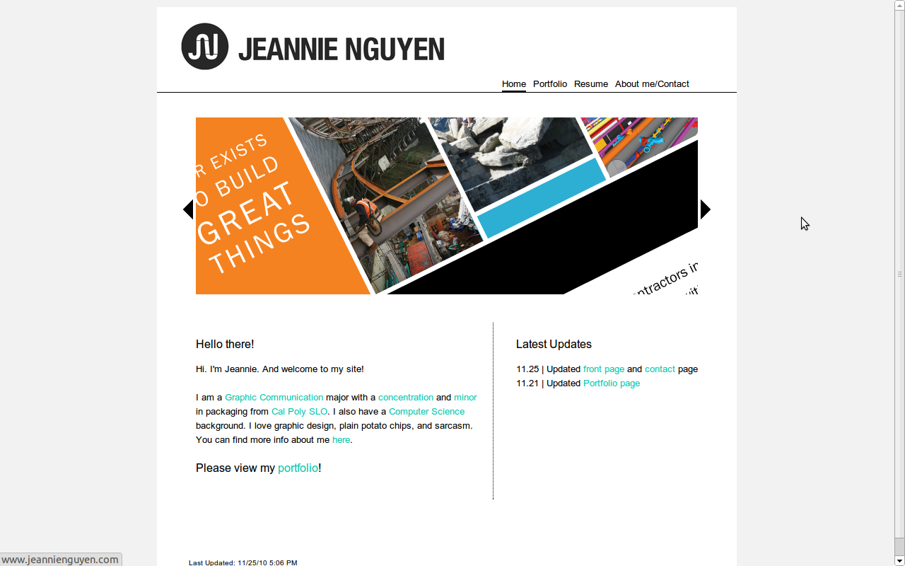

!SLIDE smbullets 15seconds 1
# Nat Welch 
### natwelch.com  /  @icco

!SLIDE 15seconds 2
# IANA*

!SLIDE 15seconds bullets 3
# Assumptions

 * Aimed mainly at college students.  <small>(But general advice is here too...)</small>
 * You believe in financial risk taking.  <small>(See previous assumption)</small>
 * You don't really want to work at a large company right out of college.

!SLIDE 15seconds smaller 4
# Share Your Work

!SLIDE 15seconds bullets 5
# Excuses for not sharing:

 * It's too hard
 * My work sucks
 * No one cares

!SLIDE 15seconds bullets 6
# (partially) Lies!

 * takes 30 minutes
 * you will actually come back to it
 * 90% of the time, no one cares

!SLIDE 15seconds smbullets 7
# But that 10% of the time can get you to:

 * start a company 
 * work with really cool people (excuse to drink beer) 
 * make you super-duper internet famous.

!SLIDE 15seconds 8
# Facebook Thing

## Control your face on the web

!SLIDE 15seconds 9

## I'll be giving a three step how-to in a few slides

# But let's look at social circles for a minute.

!SLIDE 15seconds 10

!SLIDE 15seconds 11

# Don't be afraid to contact people

 * Be curtious, offer something in return for their help

!SLIDE 15seconds bullets 13
# Step 1!

 * Get a website.  <small>Simplest Way: [Github Pages][ghp] and a domain name.</small>
 * Put your name on it, and five pieces of information about yourself.

[ghp]: http://pages.github.com/

!SLIDE 15seconds bullets 14
# Places not to put your website:

 * Your csc user page
 * some obscure url

!SLIDE 3seconds full-page 15

!SLIDE 3seconds full-page 15

!SLIDE 3seconds full-page 15

!SLIDE 3seconds full-page 15

!SLIDE 3seconds full-page 15

!SLIDE 15seconds smbullets 16
# Step 2.

 * Pick 3 things you have done.
 * Clean them up, write a README
 * put them somewhere <small>(github repos, a folder on your site)</small>
 * Link to them from your webpage

!SLIDE 15seconds 17
# So you've got a website...

# What now?

## First off: Link to your page from wherever you exist online <small>(Facebook, LinkedIn, Twitter, whatever.)</small>

!SLIDE 15seconds 18
# 18

!SLIDE 15seconds 19
# 19

!SLIDE 20
# Thanks!
## The End.
### slides: [natwelch.com/talks/presence/](http://natwelch.com/talks/presence/)

