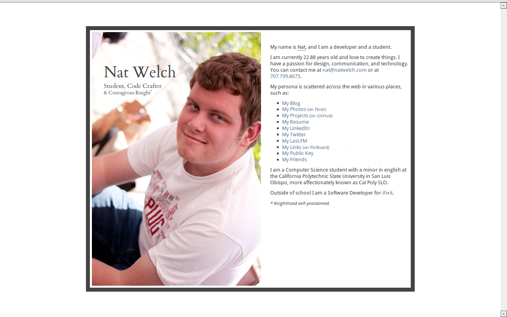

!SLIDE smbullets center 15seconds

### natwelch.com  /  @icco

!SLIDE 15seconds smaller
# Share Your Work

!SLIDE 15seconds bullets
# Excuses for not sharing:

 * It's too hard
 * My work sucks
 * No one cares

!SLIDE 15seconds bullets
# (partially) Lies!

 * takes 30 minutes
 * you will actually come back to it
 * 90% of the time, no one cares

!SLIDE 15seconds smbullets
# But that 10% of the time can get you to:

 * start a company 
 * work with really cool people (excuse to drink beer) 
 * make you super-duper internet famous.

!SLIDE 15seconds
# BUT WHY WAIT?!?!

## ACT NOW!

### (Contact them first)

!SLIDE 15seconds smbullets center

### Be courteous, offer something in return for their help

!SLIDE 15seconds
# But what are you going to talk about?
## How about you?

!SLIDE 15seconds bullets
# Step 1!

 * Get a website.  <small>Simplest Way: [Github Pages][ghp] and a domain name.</small>

[ghp]: http://pages.github.com/

!SLIDE 15seconds bullets

 * Put your name on it, and five pieces of information about yourself.

!SLIDE 15seconds bullets

 * Pick 3 things you have done.
 * Clean them up, write a README
 * put them somewhere <small>(github repos, a folder on your site)</small>
 * Link to them from your webpage

!SLIDE 15seconds bullets
# Places not to put your website:

 * some obscure url
 * a.k.a. Your CSC user page

!SLIDE 15seconds full-page

!SLIDE 15seconds full-page

!SLIDE 15seconds full-page

!SLIDE 15seconds
# So you've got a website...

# What now?

## Link to your page from wherever you exist online. <small>(Facebook, LinkedIn, Twitter, email, whatever.)</small>

!SLIDE 15seconds

# Let's look at social circles for a minute.

!SLIDE 15seconds full-page

!SLIDE 15seconds
## Each one of those dots is someone you could be drinking with RIGHT NOW

### Maybe they have input on your book, startup, crazy idea, strange rash, etc.

!SLIDE
# Thanks!
## The End.
### slides: [natwelch.com/talks/self-promotion/](http://natwelch.com/talks/self-promotion/)

